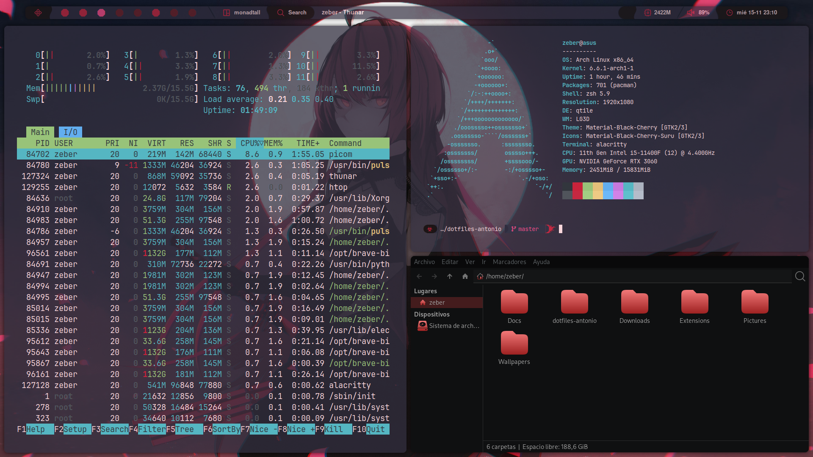

# dotfiles
These dotfiles contain my personal configurations for Arch Linux. They are designed to streamline setting up new devices or quickly restoring my preferred configurations.

## Acknowledgments

I've drawn inspiration and learned from the following repositories, integrating some of their concepts into my configurations:
- [Darkkal44/Cozytile](https://github.com/Darkkal44/Cozytile)
- [antoniosarosi/dotfiles](https://github.com/antoniosarosi/dotfiles)

## Screenshots

